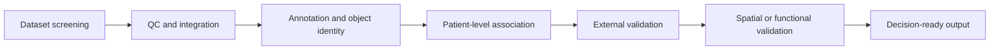

# Golden Research Action Guide Example

This is a compact but validator-passing example shape.

## Executive Decision

The project may start dataset screening for therapy-associated myeloid states, but mechanism claims remain provisional until spatial and perturbational evidence are available.

## Scientific Premise

The biological premise is that a therapy-associated myeloid state may influence response. Direct evidence supports a response association in discovery data; inference is needed to connect the state to mechanism. The boundary of inference is clinical translation: one discovery cohort cannot establish generality.

## Dataset Screening Criteria

| Criterion | Required / preferred / exclusion | Scientific reason | Literature support | Risk if missing |
|---|---|---|---|---|
| response labels | required | Needed to test therapy association. | Audit P0001 | Cannot interpret clinical signal. |
| patient identifiers | required | Needed for statistical unit control. | Audit P0001 | Pseudoreplication. |
| raw metadata | required | Needed to inspect confounding factor risks. | Audit P0001 | Hidden batch or treatment bias. |
| spatial evidence | preferred | Tests tissue-context identity. | Audit P0002 | Location claim remains inference. |

## Inclusion And Exclusion Standards

| Decision | Standard | Reason | Example evidence role |
|---|---|---|---|
| include | Response labels plus patient-level metadata. | Supports clinical association. | validation precedent |
| downgrade | Missing spatial support. | Mechanism or niche claim remains weak. | failure boundary |
| hold | Promising abstract without methods. | Needs full text before audit. | candidate |
| exclude | No patient identifiers. | Cannot protect statistical unit. | data strategy precedent |

## QC And Integration Plan

Sample-level QC should inspect per-patient cell counts, library quality, platform, and batch. Cell-level QC should check low-quality cells, doublets, ambient RNA, and sample distribution. Integration should correct technical variation while preserving response-associated biology.

## Annotation And Object-Definition Strategy

The target object is a therapy-associated myeloid state. Annotation requires marker support, reference mapping, malignant exclusion if relevant, and patient-level distribution checks. Spatial niche definition requires tissue-region context.

## Downstream Analysis Module Selection

| Module | Evidence role | Why needed | Input requirement | Failure mode | Supporting papers |
|---|---|---|---|---|---|
| patient-level association | clinical association | Tests response link. | response labels | cell-level pseudoreplication | P0001 |
| spatial localization | spatial context | Tests niche claim. | spatial data | inferred location unsupported | P0002 |
| pathway analysis | mechanism hypothesis | Suggests biology to validate. | robust state signature | decorative pathway list | P0001 |
| external cohort validation | external replication | Tests generality. | independent cohort | discovery-only result | P0003 |

## Statistical Design And Confounding Control

The statistical unit is patient for response claims. Major confounding factor risks are treatment timing, cancer type, stage, tissue site, platform, and sample source. Use patient-level aggregation, covariates where metadata support them, and sensitivity analyses by cohort or study.

## Minimum Sufficient Route

| Module | Essential / optional / avoid | Direct evidence or inference | Risk if wrong | Next action |
|---|---|---|---|---|
| dataset screening | essential | direct evidence | Wrong boundary of inference. | Screen metadata first. |
| QC/integration | essential | direct evidence | Technical noise becomes biology. | Inspect diagnostics. |
| annotation | essential | direct evidence plus inference | Wrong biological object. | Build marker/reference ledger. |
| broad analysis full stack | avoid | inference only | Complexity without stronger claim. | Add only if it tests a failure mode. |

## Validation Hierarchy

Internal consistency is needed before interpretation. External cohort or cross-platform validation is needed before generalization. Spatial evidence is needed before niche claims. Functional validation is needed before mechanism claims. Clinical endpoint evidence is needed before translation claims.

## Decision Rationale

| Project choice | Scientific rationale | Direct evidence | Inference | Assumption | Risk if wrong | Next action |
|---|---|---|---|---|---|---|
| require response labels | The claim is therapy-associated. | P0001 labels | Response labels transfer across cohorts. | Labels are comparable. | False clinical association. | Check definitions. |
| use patient as unit | Response is patient-level. | P0001 design | Aggregation preserves signal. | Enough patients exist. | Inflated significance. | Count patients per group. |
| require external validation | Discovery cohort is insufficient. | P0003 | External cohort is comparable. | Metadata align. | Overfit signature. | Search cohorts. |

## Literature Support

| Recommendation | Supporting paper/audit | Evidence location | Direct evidence or inference |
|---|---|---|---|
| require patient identifiers | P0001 | audit data strategy | direct evidence |
| prioritize external cohort | P0003 | audit validation logic | direct evidence |
| treat mechanism as provisional | P0002 | synthesis gap | inference |

## Technical Roadmap

## Next Actions

1. Search datasets with response labels, treatment timing, patient identifiers, and raw metadata.
2. Retrieve full text and supplements for papers with external cohort or spatial validation.
3. Prototype QC, annotation, and patient-level association before optional modules.
4. Mark mechanism and clinical translation decisions as blocked until validation hierarchy requirements are met.
